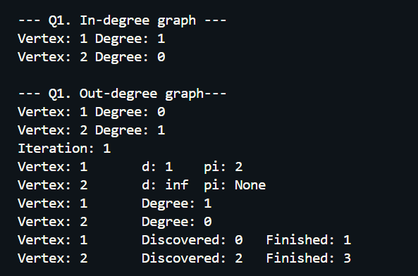

# Assignment 3 : Graph Algorithm

### SER 501 : Advance Data Structure and Algorithm

Introduction : 
The Assignment implements graph Algorithm on Directed Graphs represented by Adjanceny Matrix. The goal is to apply efficient algorithm to solve grapgh problems

File edited : assignment_3.py

Expected Objectives : 
1. Calculating in-degrees and out-degrees of vertices in DG.
2. Finding Transpose by reversing all edges in DG.
3. Performing DFS on graph and classifying Edges.
4. Implementing Prim's Algorithm for Minimum Spanning Tree (MST).
5. Finding shortest path using Bellman Ford Algorithm. 
6. Using Dijkstra's Algorithm to compute shortest path.

#### Problems and  Solutions :  

###### Q1 : In-Degrees and Out-Degree Calculations 
-->  Computing in-degree and out-degree of each vertex in directed graph.
*  Functions :  `in_degrees()`  , `out_degrees()`
* Implementation : 
    * `in_degrees()` iterates over columns to count incoming edges for each vertex.
    * `out_degrees()` iterates over columns to count outgoing edges for each vertex.
    * **Helper function** => `print_degree()` is used by both functions to give formatted output.

* Time Complexiety :
    * Calculating `in_degrees()` =>  **`O(V^2)`**   
    [ iterating over vertices and edges or column's VxV ]
    * Calculating `out_degrees()` => **`O(V^2)`**  
    [ traversing through Adjacency matrix ]

* Output Image :  

###### Q2 : Graph Transpose
--> Reverse all edges in graph to get transpose graph.
* Function : `transpose()`
* Implementation : 
    * Funtions swaps rows and columns to reverse all edge direction
    * Updates original matrix with transposed version.

* Time Complexiety : 
    * Finding Transpose of Matrix  => **`O(V^2)`**  
    [ iterating over all edges ]

* Output Image : 

###### Q3 : Depth First Search (DFS)
--> Implemented DFS to search graph, and record discover and finsih time for each vertex.
* Function : `dfs_on_graph()`
* Implementation : 
    * Recusrsive Function `dfs_visited()` performs dfs and record respective time in specified order
* Edge classification : 
    * **Tree Edges** connects vertices in DFS tree.
    * **Back Edges** link vertex to ancestor.
    * **Forward Edges** connect vertex to descendant in dfs tree.
    * **Cross Edges** link two vertices without ancestrsl relationship.
* TIme Complexiety : 
    * Every vertex(V) and edge(E) explored once => **`O(V+E)`**

* Output Image : 

###### Q4 :  Prim's Algorithm for MST
--> Computing MST from root verter using linear search..
* Function : `prim(self, root)`
* Implementation : 
    * Linear Search is used to find min weight edge to add to MST
    * `print_d_and_pi()` method gives outpput MST state after each iteration
* Time Complexiety :
    * Starting with single vertex(V) and adding each edge(E) at a time => **`O(ElogV)`**

* Output Image : 

    
###### Q5 : Bellman Ford Algorithm 
--> Bellman ford Algorithm implementation to find shortest path from soure and  stability using different edge weights 
* Function : `bellman_ford(self, source)`
* Implementation : 
    * Relax edges (V-1)times for each vertex.
    * Demonstrated the algorithm in normal and alternate edge weight scenario as well.
    * Output using **Helper Function** : `print_d_and_pi()` after each pass.
* Time Complexity : 
    * Each edge(E) is relaxed for each vertex(V)  => **`O(VxE)`**

* Output Image : 
1. Bellman Ford -

2. Bellman Ford Alternate -

###### Q6 : Dikstra's Algorithm 
--> Calculate shortest path from source vertex using Dijkstra's 
* Function : `dijkstra(self, source)`
* Implementation : 
    * Dijkstra updates distances and predecesors iteratively based on min edge weights.
    * `print_d_and_pi()` for output having path information after each iteration.
* Time Complexiety :
    *  Linear Search for smallest distance vertex =>  **`O(V^2)`**

Output Image : 

Python CODE  : 

# -*- coding: utf-8 -*-
"""
SER501 Assignment 3 scaffolding code
created by: Xiangyu Guo
edited by: Ritik Zambre --> 🤣
"""
import sys

# =============================================================================
class Graph(object):
    """docstring for Graph"""

    user_defined_vertices = []
    dfs_timer = 0

    def __init__(self, vertices, edges):
        super(Graph, self).__init__()
        n = len(vertices)
        self.matrix = [[0 for x in range(n)] for y in range(n)]
        self.vertices = vertices
        self.edges = edges
        for edge in edges:
            x = vertices.index(edge[0])
            y = vertices.index(edge[1])
            self.matrix[x][y] = edge[2]

    def display(self):
        print(self.vertices)
        for i, v in enumerate(self.vertices):
            print(v, self.matrix[i])

    # transpose of matrix
    def transpose(self):

        # [i][j] is swapped by [j][i]

        print("\n--- Q2. Transposed Matrix ---")
        transposed_matrix = [
            [0] * len(self.matrix) for _ in range(len(self.matrix))
        ]  # store new transpose
        for i in range(len(self.matrix)):
            for j in range(len(self.matrix)):
                transposed_matrix[j][i] = self.matrix[i][j]  # swap indexes to transpose

        self.matrix = transposed_matrix

        # #transposed done with List compresion (swaping the indices)
        # print('Transposed Matrix M-2')
        # n = len(self.matrix)
        # transposed_matrix = [[self.matrix[j][i] for j in range(n)] for i in range(n)]
        # self.matrix = transposed_matrix

    # in_degree
    def in_degree(self):

        print("\n--- Q1. In-degree graph ---")
        in_degree_track = {
            i: 0 for i in range(len(self.matrix))
        }  # dictionary to track in-degree

        # traverse the matrix to countt the degrees
        for i in range(len(self.matrix)):
            for j in range(len(self.matrix)):
                if self.matrix[i][j] != 0:  # incoming edge
                    in_degree_track[i] += 1

        for vertex, degree in in_degree_track.items():
            print(
                f"Vertex: {self.vertices[vertex]} Degree: {degree}"
            )  # print in-degree for each vertex

    # out_degree
    def out_degree(self):
        print("\n--- Q1. Out-degree graph---")
        out_degree_track = {i: 0 for i in range(len(self.matrix))}

        # traver #traverse the matrix to countt the degrees
        for i in range(len(self.matrix)):
            for j in range(len(self.matrix)):
                if self.matrix[i][j] != 0:  # outgoing edge
                    out_degree_track[j] += 1

        for vertex, degree in out_degree_track.items():
            print(
                f"Vertex: {self.vertices[vertex]} Degree: {degree}"
            )  # print out-degree for each vertex

    def dfs_on_graph(self):
        time = 0
        discovered = [-1] * len(self.matrix)  # time to discover vertex
        finished = [-1] * len(self.matrix)  # time to finish vertex
        visited = [False] * len(self.matrix)  # visit status

        def dfs_visited(curr_node):
            nonlocal time
            visited[curr_node] = True
            time += 1
            discovered[curr_node] = time
            for next_node in range(len(self.matrix[curr_node])):
                if self.matrix[curr_node][next_node] != 0 and not visited[next_node]:
                    dfs_visited(next_node)  # recursive dfs on adjacent/next_node
            time += 1
            finished[curr_node] = time

        for curr_node in range(len(self.matrix)):
            if not visited[curr_node]:
                dfs_visited(curr_node)

        self.print_discover_and_finish_time(discovered, finished)

    def prim(self, root):
        total_vertice = len(self.matrix)
        d = [float("inf")] * total_vertice  # shortest weight to add in mst
        pi = [None] * total_vertice  # parent vertex
        d[self.vertices.index(root)] = 0  # distance of root vertex to 0

        visited = [False] * total_vertice

        self.print_d_and_pi("Initial", d, pi)

        for iterations in range(total_vertice):

            min_distance = float("inf")
            curr_vertex = -1

            for vertex in range(total_vertice):
                if not visited[vertex] and d[vertex] < min_distance:
                    min_distance = d[vertex]
                    curr_vertex = vertex

            if curr_vertex == -1:
                break

            visited[curr_vertex] = True  # curr vertex visited

            # updating adj vertices distances
            for candidate_vertex in range(total_vertice):
                if (
                    self.matrix[curr_vertex][candidate_vertex] != 0
                    and not visited[candidate_vertex]
                ):
                    weight = self.matrix[curr_vertex][candidate_vertex]
                    if weight < d[candidate_vertex]:
                        d[candidate_vertex] = weight
                        pi[candidate_vertex] = self.vertices[curr_vertex]

            if iterations > 0 or d != [float("inf")] * total_vertice:
                self.print_d_and_pi(iterations, d, pi)

    def bellman_ford(self, source):

        total_vertices = len(self.matrix)
        d = [float("inf")] * total_vertices  # shortest distances
        pi = [None] * total_vertices  # parent vertice
        d[self.vertices.index(source)] = 0

        self.print_d_and_pi("Initial", d, pi)

        for i in range(total_vertices - 1):
            for u, v, weight in self.edges:
                u_index = self.vertices.index(u)
                v_index = self.vertices.index(v)

                if (
                    d[u_index] != float("inf") and d[u_index] + weight < d[v_index]
                ):  # checking shorter path
                    d[v_index] = d[u_index] + weight  # update weight
                    pi[v_index] = u  # update parent
                    changes = True

            if changes:
                self.print_d_and_pi(i, d, pi)

        print("No Solution")

    def dijkstra(self, source):
        total_vertices = len(self.matrix)
        d = [float("inf")] * total_vertices
        pi = [None] * total_vertices
        source_index = self.vertices.index(source)
        d[source_index] = 0

        visited = [False] * total_vertices

        self.print_d_and_pi("Initial", d, pi)

        for iteration in range(total_vertices):

            min_distance = float("inf")
            curr_vertex = -1

            for i in range(total_vertices):
                if not visited[i] and d[i] < min_distance:
                    min_distance = d[i]
                    curr_vertex = i

            # no vertex confdition
            if curr_vertex == -1:
                break

            visited[curr_vertex] = True
            changes = False

            for candidate_vertex in range(total_vertices):
                if (
                    self.matrix[curr_vertex][candidate_vertex] != 0
                    and not visited[candidate_vertex]
                ):
                    weight = self.matrix[curr_vertex][candidate_vertex]
                    if d[curr_vertex] + weight < d[candidate_vertex]:
                        d[candidate_vertex] = d[curr_vertex] + weight
                        pi[candidate_vertex] = self.vertices[curr_vertex]
                        changes_made = True

            if changes_made:
                self.print_d_and_pi(iteration + 1, d, pi)

    # conditions  DO NOT MODIFY <--STARTS HERE-->

    def print_d_and_pi(self, iteration, d, pi):
        assert (len(d) == len(self.vertices)) and (len(pi) == len(self.vertices))

        print("Iteration: {0}".format(iteration))
        for i, v in enumerate(self.vertices):
            val = "inf" if d[i] == float("inf") else d[i]
            print("Vertex: {0}\td: {1}\tpi: {2}".format(v, val, pi[i]))

    def print_discover_and_finish_time(self, discover, finish):
        assert (len(discover) == len(self.vertices)) and (
            len(finish) == len(self.vertices)
        )
        for i, v in enumerate(self.vertices):
            print(f"Vertex: {v}\tDiscovered: {discover[i]}\tFinished: {finish[i]}")

    def print_degree(self, degree):
        assert len(degree) == len(self.vertices)
        for i, v in enumerate(self.vertices):
            print("Vertex: {0}\tDegree: {1}".format(v, degree[i]))

def main():
    # Thoroughly test your program and produce useful output.
    # Q1 and Q2

    graph = Graph(["1", "2"], [("1", "2", 1)])
    print("\n --- Example Matrix  ---\n")
    graph.display()
    graph.transpose()
    graph.display()

    graph.in_degree()

    graph.out_degree()

    # print("this is test ")
    # graph.print_d_and_pi(1, [1, sys.maxsize], [2, None])

    # graph.print_degree([1, 0])

    # graph.print_discover_and_finish_time([0, 2], [1, 3])

    # Q3
    print("\n--- Q3. DFS Traversal ---")
    graph = Graph(
        ["q", "r", "s", "t", "u", "v", "w", "x", "y", "z"],
        [
            ("q", "s", 1),
            ("s", "v", 1),
            ("v", "w", 1),
            ("w", "s", 1),
            ("q", "w", 1),
            ("q", "t", 1),
            ("t", "x", 1),
            ("x", "z", 1),
            ("z", "x", 1),
            ("t", "y", 1),
            ("y", "q", 1),
            ("r", "y", 1),
            ("r", "u", 1),
            ("u", "y", 1),
        ],
    )
    # graph.display()
    graph.dfs_on_graph()

    # Q4 - Prim
    print("\n--- Q4. Prim's Algorithm ---")
    graph = Graph(
        ["A", "B", "C", "D", "E", "F", "G", "H"],
        [
            ("A", "H", 6),
            ("H", "A", 6),
            ("A", "B", 4),
            ("B", "A", 4),
            ("B", "H", 5),
            ("H", "B", 5),
            ("B", "C", 9),
            ("C", "B", 9),
            ("G", "H", 14),
            ("H", "G", 14),
            ("F", "H", 10),
            ("H", "F", 10),
            ("B", "E", 2),
            ("E", "B", 2),
            ("G", "F", 3),
            ("F", "G", 3),
            ("E", "F", 8),
            ("F", "E", 8),
            ("D", "E", 15),
            ("E", "D", 15),
        ],
    )
    graph.prim("G")

    # Q5
    print("\n--- Q5. Bellman Ford ---")
    graph = Graph(
        ["s", "t", "x", "y", "z"],
        [
            ("t", "x", 5),
            ("t", "y", 8),
            ("t", "z", -4),
            ("x", "t", -2),
            ("y", "x", -3),
            ("y", "z", 9),
            ("z", "x", 7),
            ("z", "s", 2),
            ("s", "t", 6),
            ("s", "y", 7),
        ],
    )
    graph.bellman_ford("z")

    # Q5 alternate
    print("\n--- Q5. Bellman Ford ALternate ---")
    graph = Graph(
        ["s", "t", "x", "y", "z"],
        [
            ("t", "x", 5),
            ("t", "y", 8),
            ("t", "z", -4),
            ("x", "t", -2),
            ("y", "x", -3),
            ("y", "z", 9),
            ("z", "x", 4),
            ("z", "s", 2),
            ("s", "t", 6),
            ("s", "y", 7),
        ],
    )
    graph.bellman_ford("s")

    # Q6
    print("\n--- Q6. Djikstra's Algorithm ---")
    graph = Graph(
        ["s", "t", "x", "y", "z"],
        [
            ("s", "t", 3),
            ("s", "y", 5),
            ("t", "x", 6),
            ("t", "y", 2),
            ("x", "z", 2),
            ("y", "t", 1),
            ("y", "x", 4),
            ("y", "z", 6),
            ("z", "s", 3),
            ("z", "x", 7),
        ],
    )
    graph.dijkstra("s")

    # conditions  DO NOT MODIFY <-- ENDS HERE -->

if __name__ == "__main__":
    main()
